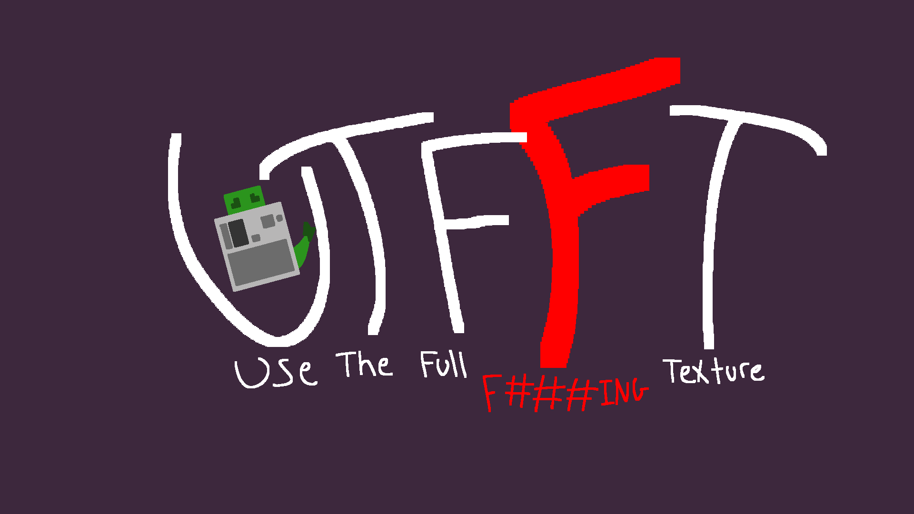

# UTFFT
Use The Full F###ING Texture

## so... what does it even do?
On it's own, not very much. This client side mod uses mixins to tell minecraft to stop hardcoding texture bounds for GUIs.

Without much extra work, resource pack creators can finally use the bottom and right empty space of a texture file! With a little extra work, resource pack creators can offset the start of a GUI to be able to add extra stuff to the top and left sides of an inventory!

## Okay, so how do I do it?
I'm not the best at this, so I tried my best to make it simple. Let me break it down for you.

Obviously, you make a resource pack. Do all your standard resource pack stuff. To configure things with UTFFT, you have to add "utfft" as a namespace with a folder named "gui" within it.
If you want to add a config to a GUI, take the GUI's name and make a .properties file for it. For example, for the player inventory we would make a file named "inventory.properties" because the player inventory is named "inventory.png"

Using the example above, the structure would look like this:
- (Your Resource Pack name)
  - pack.mcmeta
  - assets
    - minecraft
      - (minecraft texture stuff)
    - utfft
      - gui
        - inventory.properties

The .properties file for a GUI has 4 things that can be set.
- width
  - The width of the texture file
- height
  - The height of the texture file
- x_offset
  - If you moved the texture file from the top left, this is the amount of pixels it moved to the right.
- y_offset
  - If you moved the texture file from the top left, this is the amount of pixels it moved to the bottom.
